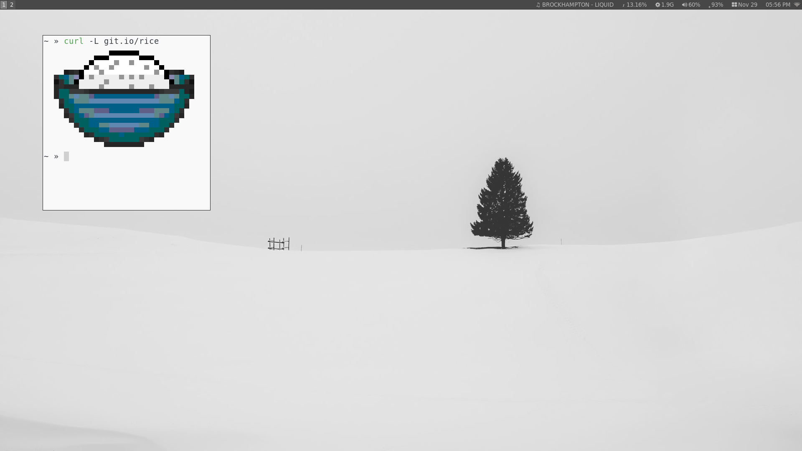

# dotfiles

Personal dotfiles managed with [yadm](https://yadm.io).



## First-time setup (this machine)

Run the migration script from inside the repo. It copies dotfiles to their proper `$HOME` locations and stages them with yadm.

```sh
cd ~/dotfiles
./install.sh
```

Then commit and push:

```sh
yadm commit -m "Initial dotfiles"
yadm remote add origin <url>
yadm push -u origin master
```

After this, the `~/dotfiles` directory is no longer needed — yadm manages files directly in `$HOME` via its own internal git repo at `~/.local/share/yadm/repo.git`.

## New machine

```sh
yadm clone <remote-url>
```

yadm clones the repo, checks out all tracked files into `$HOME`, and automatically runs `.config/yadm/bootstrap` for any post-clone setup (e.g. installing Homebrew on macOS).

## Day-to-day usage

yadm wraps git, so all standard git commands work:

```sh
yadm status                        # see what's changed
yadm diff                          # diff tracked files
yadm add ~/.zprofile               # stage a change
yadm commit -m "update zprofile"   # commit
yadm push                          # push to remote
```

To start tracking a new dotfile:

```sh
yadm add ~/.config/foo/bar
yadm commit -m "track foo config"
yadm push
```

## Files tracked

| File | Purpose |
|---|---|
| `.zprofile` / `.zpreztorc` | Zsh shell config |
| `.tmux.conf` | tmux config |
| `.screenrc` | GNU screen config |
| `.Xresources` | X11 resources |
| `.xinitrc` | X11 session startup |
| `.vim/` | Vim config and plugins |
| `.config/nvim/init.vim` | Neovim config |
| `.config/i3/` | i3 window manager config |
| `.config/dunst/` | dunst notification daemon config |
| `.config/termite/` | Termite terminal config |
| `.config/yadm/bootstrap` | Post-clone bootstrap script |

## Installing yadm

| Platform | Command |
|---|---|
| macOS | `brew install yadm` |
| Arch Linux | `sudo pacman -S yadm` |
| Debian/Ubuntu | `sudo apt install yadm` |
